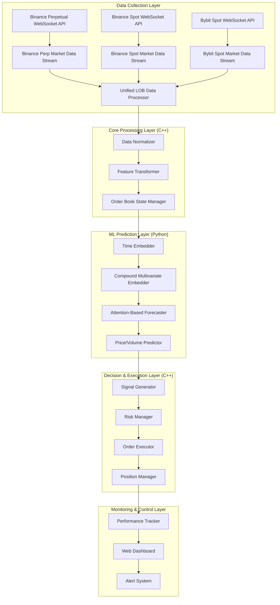
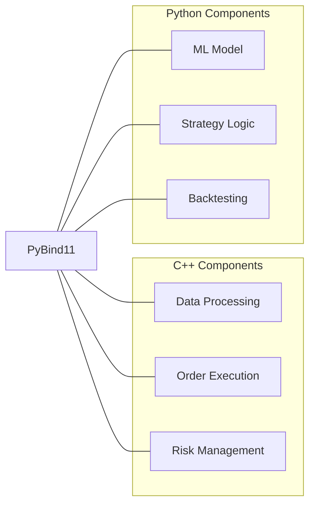

# Multi-Exchange LOB Trading Bot Architecture
*Based on Attention-Based Reading, Highlighting, and Forecasting of the Limit Order Book*

## System Architecture Overview

## Component Details

### 1. Data Collection Layer
- **Binance Perpetual WebSocket API**: Connects to Binance's perpetual futures WebSocket streams
- **Binance Spot WebSocket API**: Connects to Binance's spot market WebSocket streams
- **Bybit Spot WebSocket API**: Connects to Bybit's spot market WebSocket streams
- **Market Data Streams**: Handle real-time data ingestion (trades, order book updates) from each exchange
- **Unified LOB Data Processor**: Constructs and maintains standardized limit order books across all markets

### 2. Core Processing Layer (C++)
- **Data Normalizer**: Applies stationary transformations and scaling
  - Percent-change transformation for prices
  - Min-max scaling for volumes
  - Cross-exchange price normalization
- **Feature Transformer**: Extracts relevant features from LOB data
- **Order Book State Manager**: Maintains the current state of multiple order books (5 levels each)
  - Binance Perpetual markets
  - Binance Spot markets
  - Bybit Spot markets

### 3. ML Prediction Layer (Python)
- **Time Embedder**: Implements Time2Vec for timestamp encoding
- **Compound Multivariate Embedder**: Creates embeddings for:
  - Level (1-5)
  - Type (bid/ask)
  - Feature (price/volume)
  - Exchange (Binance Perp, Binance Spot, Bybit Spot)
  - Market type (Perpetual, Spot)
- **Attention-Based Forecaster**: Implements the attention mechanism
- **Price/Volume Predictor**: Generates forecasts for future LOB states across all markets

### 4. Decision & Execution Layer (C++)
- **Signal Generator**: Converts predictions to actionable trading signals
  - Cross-market signal correlation
  - Arbitrage opportunity detection
- **Risk Manager**: Applies position sizing and risk constraints
- **Order Executor**: Handles order placement, modification, and cancellation across exchanges
- **Position Manager**: Tracks and manages open positions across all markets

### 5. Monitoring & Control Layer
- **Performance Tracker**: Records and analyzes trading performance
- **Web Dashboard**: Provides visualization and control interface
- **Alert System**: Notifies of critical events or anomalies

## Integration Architecture

## Data Flow

1. **Real-time LOB data** is collected from multiple exchange WebSocket APIs:
   - Binance Perpetual markets
   - Binance Spot markets
   - Bybit Spot markets
2. **C++ processors** normalize, align, and transform the data
3. **Python ML model** generates predictions using attention mechanisms
4. **C++ execution engine** implements trading decisions across exchanges
5. **Performance metrics** are logged and displayed in real-time

## Implementation Priorities

1. **Data Pipeline**: Ensure reliable, low-latency data collection from multiple exchanges
2. **Data Synchronization**: Implement time-alignment of cross-exchange data
3. **ML Model**: Implement the compound attention model from the paper with exchange embeddings
4. **Execution Engine**: Develop robust order management system for multiple exchanges
5. **Cross-Market Strategies**: Implement arbitrage and correlation-based strategies
6. **Risk Controls**: Implement multiple layers of risk management
7. **Monitoring**: Create comprehensive performance tracking

## Technical Requirements

### Hardware
- Dedicated server with low-latency connection to multiple exchanges
- Minimum 64GB RAM, 16+ CPU cores
- GPU acceleration for model training and inference
- Redundant network connections

### Software
- C++17 or later for performance-critical components
- Python 3.8+ for ML components
- PyBind11 for C++/Python integration
- TensorFlow or PyTorch for neural network implementation
- Redis for inter-process communication
- InfluxDB for time-series performance data
- Grafana for monitoring dashboards
- Exchange API libraries for Binance and Bybit

## Development Roadmap

1. **Phase 1**: Multi-exchange data collection and processing infrastructure
2. **Phase 2**: Data synchronization and normalization across exchanges
3. **Phase 3**: ML model implementation with exchange embeddings
4. **Phase 4**: Model validation and performance optimization
5. **Phase 5**: Trading logic and multi-exchange execution engine
6. **Phase 6**: Cross-market strategy implementation
7. **Phase 7**: Risk management and position sizing
8. **Phase 8**: Monitoring, logging, and alerting
9. **Phase 9**: Backtesting and parameter optimization
10. **Phase 10**: Paper trading and performance evaluation
11. **Phase 11**: Live trading with limited capital
12. **Phase 12**: Scaling and optimization

## Key Performance Indicators

1. **Prediction Accuracy**: MSE, MAE of price/volume predictions
2. **Execution Latency**: Time from signal to order placement
3. **Fill Rate**: Percentage of orders successfully executed
4. **Sharpe Ratio**: Risk-adjusted return metric
5. **Maximum Drawdown**: Largest peak-to-trough decline
6. **Profit Factor**: Gross profit / gross loss

## Risk Management Framework

1. **Pre-trade Risk Controls**:
   - Maximum position size per exchange
   - Maximum order size per market
   - Price deviation checks
   - Cross-exchange exposure limits
   
2. **Post-trade Risk Controls**:
   - Stop-loss mechanisms
   - Take-profit targets
   - Exposure limits
   - Cross-market correlation monitoring
   
3. **System Risk Controls**:
   - Multi-exchange connectivity monitoring
   - Data quality and synchronization checks
   - Model drift detection
   - Exchange-specific error handling
