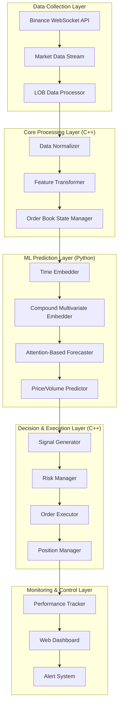
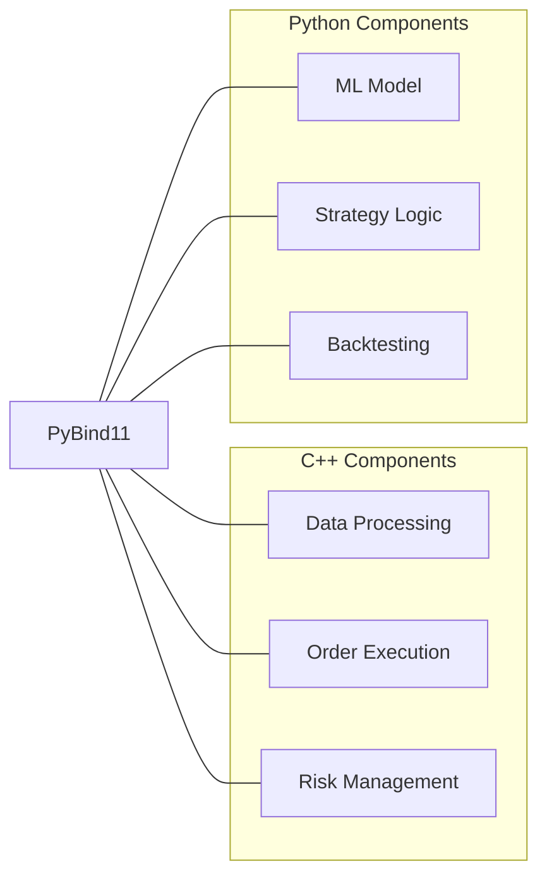

# Binance Perpetual Trading Bot Architecture
*Based on Attention-Based Reading, Highlighting, and Forecasting of the Limit Order Book*

## System Architecture Overview

## Component Details

### 1. Data Collection Layer
- **Binance WebSocket API**: Connects to Binance's perpetual futures WebSocket streams
- **Market Data Stream**: Handles real-time data ingestion (trades, order book updates)
- **LOB Data Processor**: Constructs and maintains the limit order book structure

### 2. Core Processing Layer (C++)
- **Data Normalizer**: Applies stationary transformations and scaling
  - Percent-change transformation for prices
  - Min-max scaling for volumes
- **Feature Transformer**: Extracts relevant features from LOB data
- **Order Book State Manager**: Maintains the current state of the order book (5 levels)

### 3. ML Prediction Layer (Python)
- **Time Embedder**: Implements Time2Vec for timestamp encoding
- **Compound Multivariate Embedder**: Creates embeddings for:
  - Level (1-5)
  - Type (bid/ask)
  - Feature (price/volume)
- **Attention-Based Forecaster**: Implements the attention mechanism
- **Price/Volume Predictor**: Generates forecasts for future LOB states

### 4. Decision & Execution Layer (C++)
- **Signal Generator**: Converts predictions to actionable trading signals
- **Risk Manager**: Applies position sizing and risk constraints
- **Order Executor**: Handles order placement, modification, and cancellation
- **Position Manager**: Tracks and manages open positions

### 5. Monitoring & Control Layer
- **Performance Tracker**: Records and analyzes trading performance
- **Web Dashboard**: Provides visualization and control interface
- **Alert System**: Notifies of critical events or anomalies

## Integration Architecture

## Data Flow

1. **Real-time LOB data** is collected from Binance WebSocket API
2. **C++ processors** normalize and transform the data
3. **Python ML model** generates predictions using attention mechanisms
4. **C++ execution engine** implements trading decisions
5. **Performance metrics** are logged and displayed in real-time

## Implementation Priorities

1. **Data Pipeline**: Ensure reliable, low-latency data collection
2. **ML Model**: Implement the compound attention model from the paper
3. **Execution Engine**: Develop robust order management system
4. **Risk Controls**: Implement multiple layers of risk management
5. **Monitoring**: Create comprehensive performance tracking

## Technical Requirements

### Hardware
- Dedicated server with low-latency connection
- Minimum 32GB RAM, 8+ CPU cores
- Optional GPU acceleration for model training

### Software
- C++17 or later for performance-critical components
- Python 3.8+ for ML components
- PyBind11 for C++/Python integration
- TensorFlow or PyTorch for neural network implementation
- Redis for inter-process communication
- InfluxDB for time-series performance data
- Grafana for monitoring dashboards

## Development Roadmap

1. **Phase 1**: Data collection and processing infrastructure
2. **Phase 2**: ML model implementation and validation
3. **Phase 3**: Trading logic and execution engine
4. **Phase 4**: Risk management and position sizing
5. **Phase 5**: Monitoring, logging, and alerting
6. **Phase 6**: Backtesting and parameter optimization
7. **Phase 7**: Paper trading and performance evaluation
8. **Phase 8**: Live trading with limited capital
9. **Phase 9**: Scaling and optimization

## Key Performance Indicators

1. **Prediction Accuracy**: MSE, MAE of price/volume predictions
2. **Execution Latency**: Time from signal to order placement
3. **Fill Rate**: Percentage of orders successfully executed
4. **Sharpe Ratio**: Risk-adjusted return metric
5. **Maximum Drawdown**: Largest peak-to-trough decline
6. **Profit Factor**: Gross profit / gross loss

## Risk Management Framework

1. **Pre-trade Risk Controls**:
   - Maximum position size
   - Maximum order size
   - Price deviation checks
   
2. **Post-trade Risk Controls**:
   - Stop-loss mechanisms
   - Take-profit targets
   - Exposure limits
   
3. **System Risk Controls**:
   - Connectivity monitoring
   - Data quality checks
   - Model drift detection
